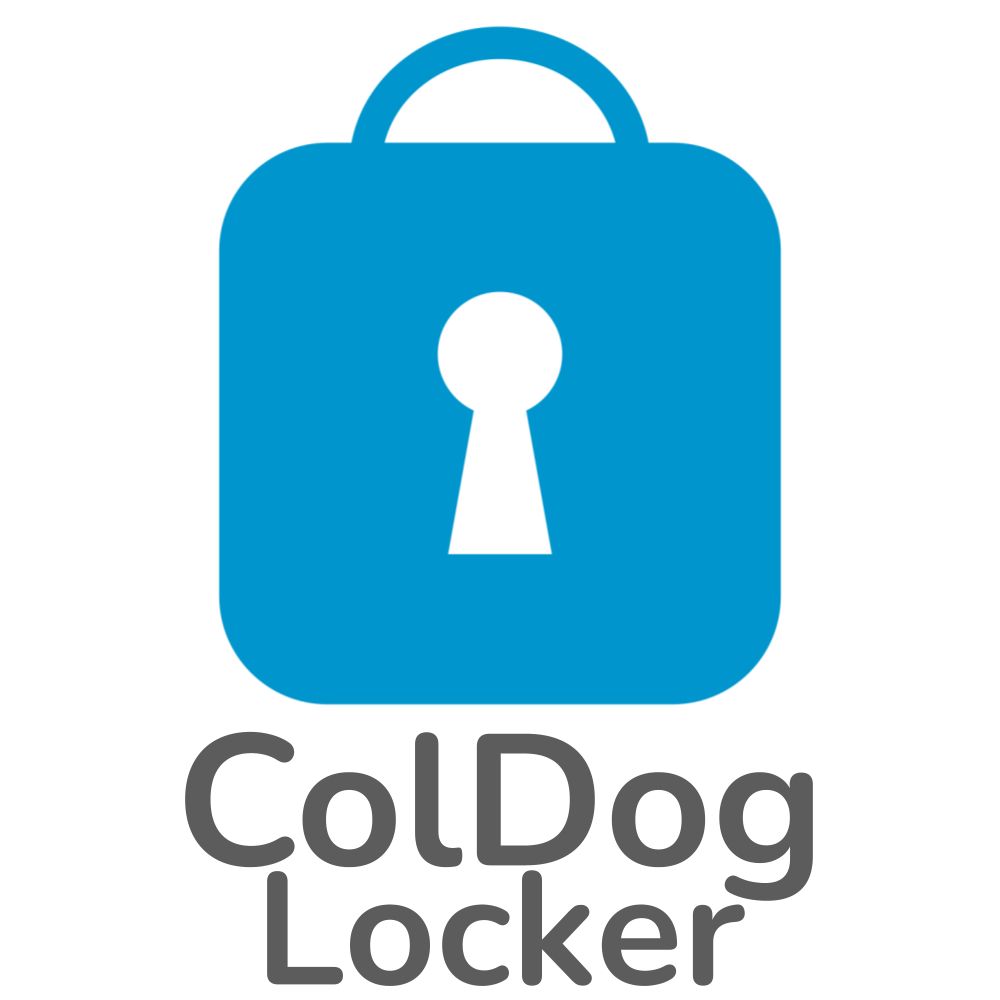

<a name="readme-top"></a>

<!-- PROJECT SHIELDS -->
[![Release][release-shield]][release-url]
[![Downloads][downloads-shield]][downloads-url]
[![Issues][issues-shield]][issues-url]
[![Stargazers][stars-shield]][stars-url]
[![LinkedIn][linkedin-shield]][linkedin-url]


<!-- PROJECT LOGO -->
<br>
<div align="center">
    <a href="https://github.com/ColDogStudios/ColDog-Locker">
      
    </a>
    
  <p align="center">
    <br>
    <em>Copyright © ColDog Studios. All rights reserved.</em>
    <br>
    <br>
    <a href="https://github.com/ColDogStudios/ColDog-Locker/tree/CDS/docs"><strong>Explore the docs »</strong></a>
    <br>
    <br>
    <a href="https://github.com/ColDogStudios/ColDog-Locker/issues/new?assignees=&labels=type%3A+question&template=ask_a_question.yml&title=%5BQuestion%5D%3A+">Ask a Question</a>
    ·
    <a href="https://github.com/ColDogStudios/ColDog-Locker/issues/new?assignees=&labels=type%3A+bug&template=bug_report.yml&title=%5BBug%5D%3A+">Report Bug</a>
    ·
    <a href="https://github.com/ColDogStudios/ColDog-Locker/issues/new?assignees=&labels=type%3A+feature&template=feature_request.yml&title=%5BFeature+Request%5D%3A+">Request Feature</a>
    ·
    <a href="https://github.com/ColDogStudios/ColDog-Locker/issues/new?assignees=&labels=type%3A+security&template=security.yml&title=%5BSecurity%5D%3A+">Security Issue</a>
    ·
    <a href="https://github.com/ColDogStudios/ColDog-Locker/security/advisories/new">Report a Vulnerability</a>
  </p>
</div>


<!-- TABLE OF CONTENTS -->
<details>
  <summary>Table of Contents</summary>
  <ol>
    <li>
      <a href="#about-the-project">About The Project</a>
      <ul>
        <li><a href="#built-with">Built With</a></li>
      </ul>
    </li>
    <li>
      <a href="#getting-started">Getting Started</a>
      <ul>
        <li><a href="#important-notice-and-disclaimer">Important Notice and Disclaimer</a></li>
        <li><a href="#compatability">Compatability</a></li>
        <li><a href="#prerequisites">Prerequisites</a></li>
        <li><a href="#installation">Installation</a></li>
      </ul>
    </li>
    <li><a href="#usage">Usage</a></li>
    <li><a href="#features">Features</a></li>
    <li><a href="#contact">Contact</a></li>
    <li><a href="#acknowledgments">Acknowledgments</a></li>
  </ol>
</details>


<!-- ABOUT THE PROJECT -->
## About The Project


<p align="right">(<a href="#readme-top">back to top</a>)</p>


### Built With

* [![.Net][.Net-shield]][.Net-url]
* [![PowerShell][PowerShell-shield]][PowerShell-url]
* [![Windows][Windows-shield]][Windows-url]
* [![C#][C#-shield]][C#-url]

<p align="right">(<a href="#readme-top">back to top</a>)</p>


<!-- GETTING STARTED -->
## Getting Started

### Important Notice and Disclaimer

ColDog Studios is committed to keeping your files secure and will fix any security vulnerability as soon as possible. ColDog Studios does not recieve any information from you such as passwords. All of the configuration is stored on your local machine.

Your anti-virus will possibly flag ColDog Locker as a virus. This is a false postitive and you need to make an exclusion.

  - By using this software, you agree that ColDog Studios is not held responsible for any data lost, stolen, or accessed.
  - The software is provided as is and without warranty as to its features, functionality, or performance.
  - Any unauthorized copying, distributing, or selling of this software is prohibited.

### Compatability

| Operating System | Supported          |
| ---------------- | ------------------ |
| Windows 11       | :heavy_check_mark: |
| Windows 10       | :heavy_check_mark: |
| < Windows 8.1    | :x:                |

| OS Architecture | Supported          |
| ----------------| ------------------ |
| Windows 64 Bit  | :heavy_check_mark: |
| Windows 32 Bit  | :x:                |


### Prerequisites

What you need before you can install and run ColDog Locker

* Windows PowerShell 5.1 or later (Preinstalled on Windows)
* .Net 3.5 or later (Preinstalled on Windows)


### Installation

1. Run PowerShell and input the following command:

        Set-ExecutionPolicy RemoteSigned -Scope CurrentUser

2. Run ```ColDog Locker Setup``` and install the software


<p align="right">(<a href="#readme-top">back to top</a>)</p>


<!-- USAGE EXAMPLES -->
## Usage

Use this space to show useful examples of how a project can be used. Additional screenshots, code examples and demos work well in this space. You may also link to more resources.

*For more examples, please refer to the [Documentation](https://example.com)*

<p align="right">(<a href="#readme-top">back to top</a>)</p>


<!-- FEATURES -->
## Features

- Folder Encryption
- Password Protected Folders
- Failed Attempts Lockout
- GitHub integrated Updates

See the [open issues](https://github.com/ColDogStudios/ColDog-Locker/issues) for a full list of proposed features (and known issues).
See the ColDog Locker [Project Board](https://github.com/orgs/ColDogStudios/projects/2) for a full list of features being worked on

<p align="right">(<a href="#readme-top">back to top</a>)</p>


<!-- CONTACT -->
## Contact

ColDog Studios - [@ColDogStudios](https://twitter.com/ColDogStudios) - contact@coldogstudios.com

[![@ColDog5044][twitter-shield]][twitter-url]
[![Collin-Laney][linkedin-shield]][linkedin-url]
[![Email][gmail-shield]][gmail-url]

Collin Laney (ColDog5044) - [@ColDog5044](https://twitter.com/ColDog5044) - collin.laney@coldogstudios.com

[![@ColDog5044][twitter-shield]][twitter-url]
[![Collin-Laney][linkedin-shield]][linkedin-url]
[![Email][gmail-shield]][gmail-url]

<p align="right">(<a href="#readme-top">back to top</a>)</p>


<!-- ACKNOWLEDGMENTS -->
## Acknowledgments

* []()
* []()
* []()

<p align="right">(<a href="#readme-top">back to top</a>)</p>


<!-- MARKDOWN LINKS & IMAGES -->
[release-shield]: https://img.shields.io/github/v/release/ColDogStudios/ColDog-Locker?style=for-the-badge
[release-url]: https://github.com/ColDogStudios/ColDog-Locker
[downloads-shield]: https://img.shields.io/github/downloads/ColDogStudios/ColDog-Locker/total.svg?style=for-the-badge
[downloads-url]: https://github.com/ColDogStudios/ColDog-Locker
[issues-shield]: https://img.shields.io/github/issues/ColDogStudios/ColDog-Locker.svg?style=for-the-badge
[issues-url]: https://github.com/ColDogStudios/ColDog-Locker/issues
[stars-shield]: https://img.shields.io/github/stars/ColDogStudios/ColDog-Locker.svg?style=for-the-badge
[stars-url]: https://github.com/ColDogStudios/ColDog-Locker/stargazers

[github-shield]: https://img.shields.io/badge/github-%23121011.svg?style=for-the-badge&logo=github&logoColor=white
[github-url]: https://github.com/
[twitter-shield]: https://img.shields.io/badge/Twitter-%231DA1F2.svg?style=for-the-badge&logo=Twitter&logoColor=white
[twitter-url]: https://twitter.com/ColDog5044
[linkedin-shield]: https://img.shields.io/badge/linkedin-%230077B5.svg?style=for-the-badge&logo=linkedin&logoColor=white
[linkedin-url]: https://www.linkedin.com/in/collin-laney/
[gmail-shield]: https://img.shields.io/badge/Gmail-D14836?style=for-the-badge&logo=gmail&logoColor=white
[gmail-url]: mailto:coldogstudios.business+GitHubContact@gmail.com

[.Net-shield]: https://img.shields.io/badge/.NET-5C2D91?style=for-the-badge&logo=.net&logoColor=white
[.Net-url]: https://dotnet.microsoft.com/
[PowerShell-shield]:https://img.shields.io/badge/PowerShell-%235391FE.svg?style=for-the-badge&logo=powershell&logoColor=white
[PowerShell-url]: https://docs.microsoft.com/en-us/powershell/
[Windows-shield]: https://img.shields.io/badge/Windows-0078D6?style=for-the-badge&logo=windows&logoColor=white
[Windows-url]: https://www.microsoft.com/en-us/windows
[C#-shield]: https://img.shields.io/badge/c%23-%23239120.svg?style=for-the-badge&logo=c-sharp&logoColor=white
[C#-url]: https://docs.microsoft.com/en-us/dotnet/csharp/
